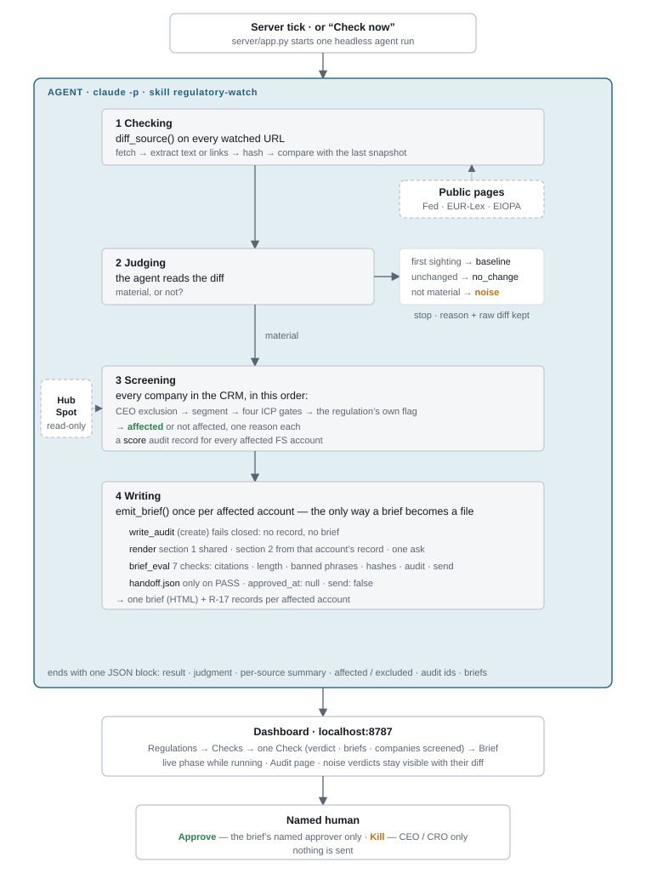

# The artifact

- **Repository:** https://github.com/yitaohou/reign-watch
- **Walkthrough (4 min):** https://www.loom.com/share/cfc7f9603f80419fa43589335b37c07a

**Reign Watch** — a Claude agent, a custom MCP server, and HubSpot, wired so that a change in a public regulation becomes one sourced, account-specific brief per affected bank, with an R-17 audit record written before anything else and a named human between the brief and any send. Code and setup are in `artifact/` and `README.md`.

## Flow

- **`regulatory-watch` skill — read · judge · screen**
  - reads the diff of every watched page against its last snapshot
  - judges whether a change is material or noise, and writes down why
  - screens every company in the CRM in a fixed order, one reason each
  - calls the brief skill once per affected account
- **`regulatory-brief` skill — write**
  - writes three sections: what changed, why it matters to this account, one ask
  - cites every sentence to a page fetched this cycle
  - phrases the account's CRM record as a condition, never as their fact
  - keeps it under 250 words with no banned phrases
- **Python — fetch · diff · record · block**
  - fetches each page and caches its text
  - diffs it against the last snapshot and stores the new one
  - records every R-17 line, every changed diff, every check
  - blocks a brief whose audit record failed or whose eval did not pass
- **HubSpot — provide**
  - holds the companies and their ten `reign_*` flags as the system of record
  - exposes them to the agent through its MCP connector, read-only tools only
  - receives nothing back
- **People — approve · kill**
  - the named approver opens the gate on one brief
  - the CEO or CRO stops the whole motion

## Where the constraints live

- **R-17** — `write_audit` refuses any record missing a field, with a vague purpose, or with an unresolvable principal, approver or object; `@audited` makes the brief's render code unreachable until the record is written; eval check 5 verifies independently that the record predates the brief.
- **Named human** — `approver` must resolve to a person in the directory; the dashboard enables Approve only for that person and the API refuses anyone else; Kill is visible only to `can_kill` humans.
- **Precision** — one change fans out to N accounts as N distinct briefs, each written from that account's own record and each approved separately; every account screened out is listed with its reason.
- **Reusability** — one `playbook_id`; a new regulation is a new trigger file and a playbook instance; a new product launch is the same playbook with `product` and `audience` changed and `version` bumped.

## Test mode

The watched documents rarely change, so the dashboard offers two scenarios that seed index-page baselines from Wayback Machine captures (January, April, August, September 2026) in a separate state tree and let a check replay what actually happened: scenario A surfaces SR 26-2 itself on the Fed index and produces a brief per affected account; scenario B surfaces SR 26-6 and is judged noise. Normal-mode state is untouched.
